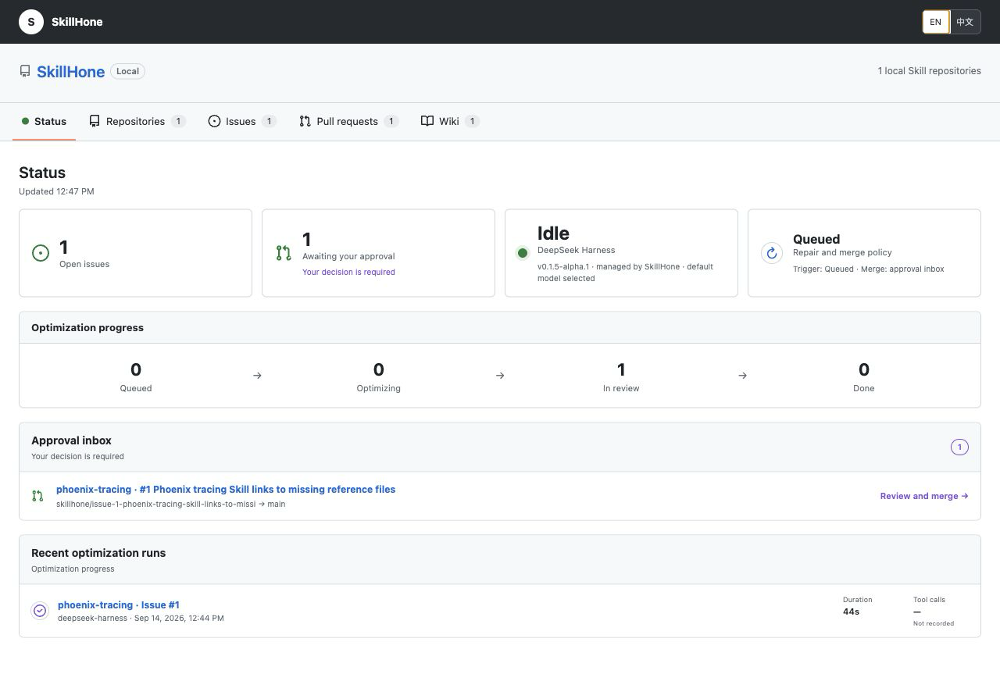

<div align="center">

# SkillHone

### Turn the Skill failures your Agents encounter into lasting improvements.

Skills break in real work: a referenced script is missing, an API changes, or an
instruction stops producing the right result. That evidence usually disappears
inside a chat. SkillHone captures the failure while the Agent is working, repairs
the complete Skill repository, runs the regression test, and leaves a local PR
for review.

*Continual Agent Skill Evolution Through Persistent Decision History*

[](https://arxiv.org/abs/2606.08671)
[](https://github.com/Tencent/SkillHone/actions/workflows/gitleaks.yml)
[](LICENSE)

[Install](docs/install/skillhone.md) ·
[中文](docs/README.zh.md) ·
[Example](examples/phoenix-tracing/) ·
[Paper](https://arxiv.org/abs/2606.08671) ·
[Security](SECURITY.md)

</div>

## News

- **[2026-09-18] Runtime feedback is now an optimization input.** Coding Agents
  can record reproducible Skill problems as they work. SkillHone queues the
  repair, verifies it, and puts the resulting local PR in the approval inbox.
- **[2026-08-21] Accepted at EMNLP 2026 Industry Track.** The paper,
  *SkillHone: A Harness for Continual Agent Skill Evolution Through Persistent Decision
  History*, has been accepted to the Industry Track.

## Why SkillHone

| Advantage | What you get |
|---|---|
| **Learns from real work** | Codex, Claude Code, Cursor, Pi, ZCode, or any CLI-capable Agent can report a reproducible failure at the moment it happens. You do not need to build a benchmark first. |
| **Repairs the whole Skill** | SkillHone can update `SKILL.md`, scripts, references, assets, and repository tests in one change. It is not limited to rewriting a prompt. |
| **Proves the fix** | Every repair is tied to an Issue, a regression test, a Git diff, a run record, and a local PR. Failed or untested changes do not enter the review queue. |
| **Keeps the history useful** | Each Skill has its own repository and decision history, so the next Agent can see what failed, what changed, and why a candidate was accepted or rejected. |
| **Leaves control with you** | Review mode waits for your merge decision. Automatic local merge is opt-in and still requires the linked tests to pass. SkillHone never pushes a Skill for you. |

For larger optimization jobs, SkillHone also retains the paper's
evaluation-driven workflow with a separate frozen Eval repository.

## Install with one prompt

Give this to your coding Agent:

> Install SkillHone from the `main` branch of
> `https://github.com/Tencent/SkillHone`. Follow
> `docs/install/skillhone.md`, make the SkillHone Skills and CLI available to
> this Agent, and verify the installation without changing unrelated files.
> Use the documented `--install-links=true` Git installation command.

SkillHone installs directly from GitHub. There is no package registry account
to configure and no hosted service to deploy.

## See it fix a public issue

[](examples/phoenix-tracing/)

**[Run the example](examples/phoenix-tracing/)** to see an Agent discover a
Skill problem during normal work, record the evidence, and return a tested
local PR in the SkillHone workbench.

The reproducible example uses a real public defect in GitHub's Phoenix tracing
Skill. Its index referenced four documents that did not exist, making the
promised guidance unavailable to Agents. See the public
[Issue #2567](https://github.com/github/awesome-copilot/issues/2567), the merged
[fix #2568](https://github.com/github/awesome-copilot/pull/2568), and the pinned
[`examples/phoenix-tracing`](examples/phoenix-tracing/) fixture.

## Choose the right mode

| Mode | Start with | Best for | Result |
|---|---|---|---|
| **Quick** | A reproducible failure found during Agent work | Missing files, broken scripts, stale instructions, API drift | Issue, regression test, focused repair, local PR |
| **Full** | A frozen dataset and verifier in a separate Eval repository | Broader capability or quality improvements | Baseline, candidate iterations, validation gates, local PR |

Quick mode removes the benchmark-building tax from everyday maintenance. Full
mode remains available when a representative evaluation set is worth the
investment. Both modes keep the change and its evidence reviewable.

## What gets improved

SkillHone improves the complete Skill repository:

```text
my-skill/
├── SKILL.md
├── scripts/
├── references/
├── assets/
└── .test/
```

SkillHone can repair executable helpers, update instructions and references,
add hidden regression tests, and package the result as one atomic PR. This is
why it can fix problems that prompt-only optimizers cannot, such as a missing
script or a broken parser.

## See every decision

The local workbench shows every Skill's Issues, tests, repair runs, commits,
changed files, PRs, approval state, and Wiki records. The Agent making the
repair cannot rewrite that history while it works. You can inspect the failure,
the test, the exact diff, and the result before deciding whether to merge.

Each repair stays local until the saved merge policy allows it. Pushing remains
a separate user action.

## Research

SkillHone preserves the diagnoses, revisions, evidence, outcomes, and rejected
alternatives that are normally lost between optimization runs. The next Agent
continues from that decision history instead of rediscovering the same failure.

In the paper's open-web evaluation, evolved Skills improved over the reported
commercial-retrieval research Agent by **15.8 points on GAIA** and **3.2 points
on WebWalkerQA-EN**. The current repository keeps that evaluation-driven method
and adds runtime feedback as a faster source of repair evidence.

> Zhiwei Li and Yong Hu. **SkillHone: A Harness for Continual Agent Skill
> Evolution Through Persistent Decision History.** EMNLP 2026 Industry Track.
> [arXiv:2606.08671](https://arxiv.org/abs/2606.08671)

SkillHone is released under the [MIT License](LICENSE). Third-party components
and their licenses are listed in
[THIRD_PARTY_NOTICES.md](THIRD_PARTY_NOTICES.md).
