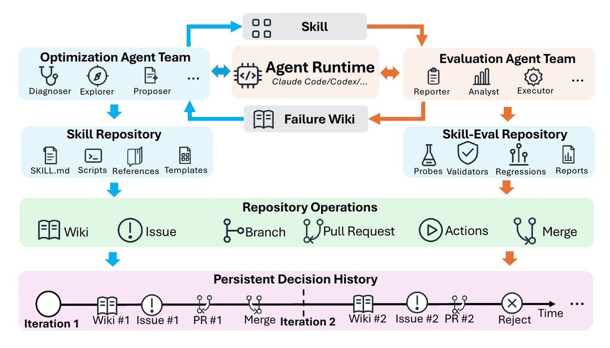
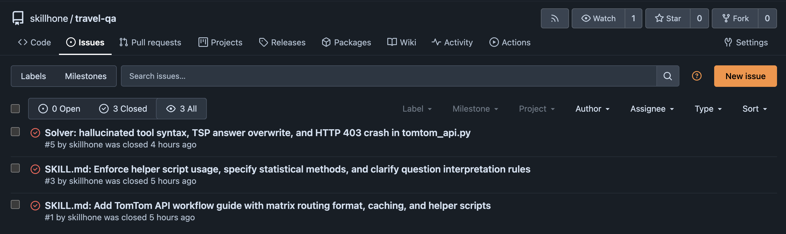
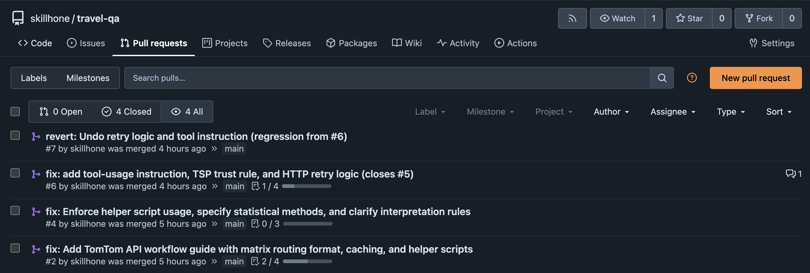
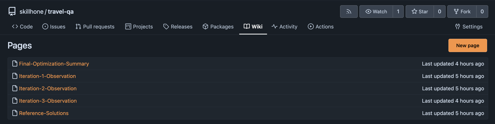

<h1 align="center">
  
  &nbsp;SkillHone-Skills
</h1>

<h3 align="center">
  基于持久化决策历史的<br>
  Agent 技能持续进化框架
</h3>

<p align="center">
  <a href="https://arxiv.org/abs/2606.08671"></a>
  
</p>

<p align="center">
  <a href="../README.md">English</a> &bull;
  <strong>简体中文</strong>
</p>

<p align="center">
  <a href="https://arxiv.org/abs/2606.08671">论文</a> &bull;
  <a href="#为什么选-skillhone">为什么选 SkillHone</a> &bull;
  <a href="#与其他技能进化项目的对比">对比</a> &bull;
  <a href="#安装">安装</a> &bull;
  <a href="#使用">使用</a> &bull;
  <a href="#整技能优化">整技能优化</a> &bull;
  <a href="#可观测性">可观测性</a> &bull;
  <a href="#一套-harness支持主流-runtime">支持的 Runtime</a> &bull;
  <a href="#评测--技能仓的硬隔离">评测 / 技能隔离</a> &bull;
  <a href="#技能集合一览">技能集合</a> &bull;
  <a href="#配置">配置</a>
</p>

<p align="center">
  <video src="https://github.com/user-attachments/assets/58ea7136-3583-475f-a8fe-4c5f6aee3363" controls width="800"></video>
</p>

---

## 为什么选 SkillHone

> **改动单元是技能文件夹，而不是一段 prompt；每次决策都会沉淀为一条可追溯的 Git 记录。**

SkillHone 与"用 LLM 改写一段 `SKILL.md` 文本"类项目的本质区别只有两点，
其余皆为工程实现细节：

- **整技能优化。** 每一个合入的 PR 都可同时改写 `SKILL.md`、
  在 `scripts/` 中新增辅助脚本、并在 `references/` 下补充
  参考文档 —— 一个原子 PR、回归 eval 把关。详细论述与一次
  `travel-qa` 实际运行所产生的真实 PR-diff 表见下文
  [整技能优化](#整技能优化)章节。
- **GitHub 式可观测性，本地部署。** 闭环里的每一步都落到一个
  可以**完全跑在你机器上**的 Git 服务器（默认 Forgejo）—— 真实的
  Issue / Branch / Commit / PR / Wiki。打开一个评审者本来就熟悉的
  界面，整条决策路径就在那儿。

让上面两点真正落地的配套特性：

- 由**代码路径和文件系统权限**强隔离的**评测 / 技能划分**，
  让 Probe 难以无意间泄露进技能指令。
- **没有 Runtime 适配层要维护。** SkillHone 本身就是一组按
  [agentskills.io](https://agentskills.io) 标准编写的 skills。
  任何已经支持 skills 的 Agent Runtime 都天然支持 SkillHone——
  例如 Claude Code、Codex、OpenClaw、Hermes，以及未来任何
  遵循同一协议的 Runtime。

## 与其他技能进化项目的对比

| 能力 | [microsoft/SkillOpt](https://github.com/microsoft/SkillOpt) | [NousResearch/hermes-agent-self-evolution](https://github.com/NousResearch/hermes-agent-self-evolution) | **SkillHone** |
|---|:---:|:---:|:---:|
| 自动进化 Agent 技能                                                  | ✅ | ✅ | ✅ |
| 开源、Python 实现                                                    | ✅ | ✅ | ✅ |
| 改动合入前会经过 hold-out 校验                                       | ✅ | ✅ | ✅ |
| **改写整个技能文件夹** —— `SKILL.md` + `scripts/` + `references/`    | ❌ | ❌ | ✅ |
| **GitHub 式审计轨迹** —— 每一步都落到 Git Issue / PR / Commit / Wiki | ❌ | ❌ | ✅ |

## 安装

把下面这段提示词复制给任意支持 skill 的 AI 助手——例如
Claude Code、Codex、OpenClaw、Lighthouse、Kimi——助手会自己抓取安装指引、
识别 Runtime，并把 SkillHone 装到正确的位置。

> 请按照 `https://raw.githubusercontent.com/Tencent/SkillHone/main/docs/install/skillhone.md`
> 的步骤安装 SkillHone。先识别我当前的 Agent Runtime，把 `skillhone` 这个
> skill 装到对应的 skills 目录，然后问我要完成配置所需的模型凭证。

之后需要更新时，再发一遍同样的提示词，让助手刷新一次安装即可。

## 使用

安装好后，按你 Runtime 调用 skill 的标准方式触发即可 —— slash 命令
（`/skillhone`）或者直接用意图描述。顶层 `skillhone` 是推荐的入口，
它会把任务分发到合适的子 skill（见下方[技能集合一览](#技能集合一览)）。

直接把下面任意一条粘给 Agent：

> `/skillhone` 帮我优化 `travel-qa` 这个 skill，跑 5 轮。

> 使用 skillhone 在最新 probe split 上评测 `travel-qa` 这个 skill。

> 使用 skillhone-prd 给一个 "code-review" 新 skill 写 PRD，然后用
> skillhone 做种子化并跑第一轮优化。

每个子 skill 的 `SKILL.md` 列出了完整的触发词和参数。

<p align="center">
  
</p>

## 整技能优化

一个 skill 本来就不是一个文件 —— 它是一个文件夹，包含
`SKILL.md`、`scripts/`、`references/`、`assets/`。当前主流的
技能进化工作只改其中一个文件 —— `SKILL.md`。**文件夹里只动
一个文件，自然修不到辅助脚本或参考页里的失败模式，而真实
的失败模式有相当一部分就在这些位置**。这种优化在结构上就**注
定到不了位** —— 它能改的只有一个文件，失败真正所在的是整个
文件夹。

真正意义上的 skill 是一个**文件夹**。除 `SKILL.md` 之外，它还
包含 `scripts/`（Agent 可直接调用的可执行辅助脚本 —— Python、
shell 均可）、`references/`（结构定义、查找表、格式说明等供
Agent 按需读取的参考资料）、`assets/`（样本与模板）。SkillHone
的优化闭环会直接修改其中任意一项：诊断 probe 失败 → 判定修复
应落在 prompt、辅助脚本、参考页中的哪一处，或多处并行 →
一次原子 PR 提交、回归 eval 把关、合入。**对整个 skill 文件夹
的修改是 SkillHone 在工程实践中最具价值的差异点** —— 这是
SkillHone 从概念走向"在 eval 上真有效果"的转折。

下表来自一次 `travel-qa` 实际运行：每一行对应一次合入的 PR，
diff 列显示这一次 PR 跨 skill 文件夹改了什么。

| PR | 修复的 Issue | 这一次合入改了哪些文件 |
|---:|---|---|
| **#2** | **#1** matrix routing 404（5 个执行器跑出 36 次失败） | `SKILL.md` +116 / −19 · `scripts/tomtom_api.py` ➕ 243（新文件） · `scripts/tsp_solver.py` ➕ 184（新文件） |
| **#4** | **#3** 统计方法挑错 —— 题目要中位数，模型用了平均数 | `SKILL.md` +62 / −5 |
| **#6** | **#5** 模型臆造工具语法 + `tomtom_api.py` HTTP 403 | `SKILL.md` +27 · `scripts/tomtom_api.py` +27 / −4 ⚠ |
| **#7** | #6 合入后回归 eval 检出退化 | `SKILL.md` 0 / −27 · `scripts/tomtom_api.py` +4 / −27（撤销 PR #6） |

仅改写 prompt 的优化器无法落地 PR #2 —— 即便它把"应改用
matrix routing"写进 prompt，Agent 在缺少 `tomtom_api.py` 的
前提下，仍会换一种语法复现同一个 404。

完整的 PR-by-PR 走查见
[`travel-qa` 示例](../examples/travel-qa/README.md)。

## 可观测性

多数同类技能进化项目把优化轨迹持久化为平铺的文本文件。SkillHone
则把每一步决策写入一台自托管 Git 服务器的标准产物——Issue、Branch、
Pull Request、Wiki——使整条优化过程呈现在任何评审者都熟悉的界面上。
该 Git 服务器（默认 Forgejo）本地运行即可，一条 `docker compose up -d`
就能启动。

下方三张截图取自我们自己的 Forgejo（`travel-qa` 这个 skill）。
每个诊断对应一个 Issue，每次改写对应一个 Pull Request，每一轮迭代的
观察沉淀为一篇 Wiki 页面。

<p align="center">
  
  <br>
  <em>Issues —— 驱动每次改写的失败案例。</em>
</p>

<p align="center">
  
  <br>
  <em>Pull requests —— 实际的技能改动。</em>
</p>

<p align="center">
  
  <br>
  <em>Wiki —— 每一轮迭代的观察，后续运行会读到。</em>
</p>

## 一套 Harness，支持主流 Runtime

把同一份 bundle 放进任何支持 skill 的 Runtime——`~/.claude/skills/`、
`~/.codex/skills/` 等——SkillHone 就能跑。例如：
**Claude Code、Codex、OpenClaw、Hermes ……**

## 评测 / 技能仓的硬隔离

公共技能仓和私有评测仓由**代码路径和文件系统权限**隔离，不靠 prompt 约定。
Probe 默认只供引擎读取，不会被复制进技能指令；标准答案保留在评测仓内。

## 技能集合一览

| 技能 | 作用 |
|---|---|
| **`skillhone`** | 顶层入口 —— 包装 `status` / `eval` / `optim` / `new` / `seed` / `synth` / `serve` 等 CLI 脚本。 |
| **`skillhone-optimization`** | 优化协调器 —— 诊断失败、规划改动、向技能仓提交聚焦的 PR。 |
| **`skillhone-evaluation`** | 评测执行与解读 —— eval / probe / PR 校验、回归检查、轨迹诊断。 |
| **`skillhone-prd`** | 交互式 PRD 编写 —— 在优化开始前，把新技能的目标、工具、评分标准定下来。 |
| **`skillhone-synthesis`** *(实验性 —— 数据合成 skill)* | **实验性** skill，用于通过探索工具环境合成可自动校验的封闭式 Q/A。仅用于评测数据集冷启动，**不属于**核心测量 / 优化闭环，接口可能随时变更。 |
| **`forgejo`** | 默认 Git 后端的 REST API 工具集 —— issue、PR、wiki、repo、branch。 |

## 配置

SkillHone 真正需要你提供的只有模型凭证。安装时把下面几个值告诉
AI 助手就行，剩下的 `~/.skillhone/settings.json` 它会自己写。

| 角色 | 是否必填 | 作用 |
|---|---|---|
| **Optimizer** | 必填 | 驱动优化闭环 —— 给技能写补丁。 |
| **Executor**  | 可选，不填则与 Optimizer 一致 | 在每条 probe 上运行被测技能。 |
| **Tester**    | 可选，不填则与 Optimizer 一致 | 给执行结果打分 / 判定。 |

如果直接走 Anthropic 官方,只需要给 AI 助手一个 Anthropic API
key 即可 —— `claude-agent-sdk` 默认就走 Anthropic 官方 endpoint。
**只有在你需要把流量转到第三方 Anthropic 兼容代理时**(例如
DeepSeek),才需要每个角色填三个字段:`base_url`(Anthropic
格式)、`api_key`、`model_name`。例如:

```ini
base_url   = https://api.deepseek.com/anthropic
api_key    = sk-xxx
model_name = deepseek-v4-pro
```

完整字段、多身份 Forgejo token、以及 `~/.skillhone/` 下的目录结构都在
[`../skills/skillhone/references/configuration.md`](../skills/skillhone/references/configuration.md)。

## 项目介绍

SkillHone-Skills 是一组围绕论文 "**SkillHone: A Harness for Continual
Agent Skill Evolution Through Persistent Decision History**"
（[arXiv:2606.08671](https://arxiv.org/abs/2606.08671)，2026）思想
构建的标准 Agent skills 集合。

论文中描述的 SkillHone harness 构建于企业内部 Agent 框架之上，
暂无开源计划。为方便社区使用，我们将其整理为一组遵循
[agentskills.io](https://agentskills.io) 协议的标准 Agent skills，
默认搭配 `claude-agent-sdk` 作为 Agent 运行时、Forgejo 作为 Git 服务器。
该 bundle 可运行于任何支持该协议的 Agent Runtime —— Claude Code、
Codex、OpenClaw、Hermes 等。

核心方法与原版一致：每一次开发步骤都被记录为
`(诊断, 候选改写, 脱敏证据, 结论)` 四元组 —— 即**持久化决策
历史**；角色分离的优化与评测 subagent 避免练习反馈泄露进技能
指令；评测仓与技能仓的隔离由代码路径与文件系统权限强制保证。
受底层 Agent 框架差异影响，存在少量实现层面的区别（例如，
角色分离通过 skill 挂载边界与代码路径强制，而非依赖框架原生
subagent 策略）。

## Star 历史

<a href="https://www.star-history.com/#Tencent/SkillHone&Date">
  <picture>
    <source media="(prefers-color-scheme: dark)" srcset="https://api.star-history.com/svg?repos=Tencent/SkillHone&type=Date&theme=dark" />
    <source media="(prefers-color-scheme: light)" srcset="https://api.star-history.com/svg?repos=Tencent/SkillHone&type=Date" />
    
  </picture>
</a>

## 引用

```bibtex
@misc{li2026skillhoneharnesscontinualagent,
  title         = {SkillHone: A Harness for Continual Agent Skill Evolution Through Persistent Decision History},
  author        = {Zhiwei Li and Yong Hu},
  year          = {2026},
  eprint        = {2606.08671},
  archivePrefix = {arXiv},
  primaryClass  = {cs.LG},
  url           = {https://arxiv.org/abs/2606.08671},
}
```

## 许可证

SkillHone 以 [MIT License](../LICENSE) 发布。

---

<p align="center">
  <sub>
    SkillHone 论文的开源实现。<br>
    Demo 视频使用 <a href="https://github.com/heygen-com/hyperframes">HyperFrames</a> 渲染。
  </sub>
</p>
